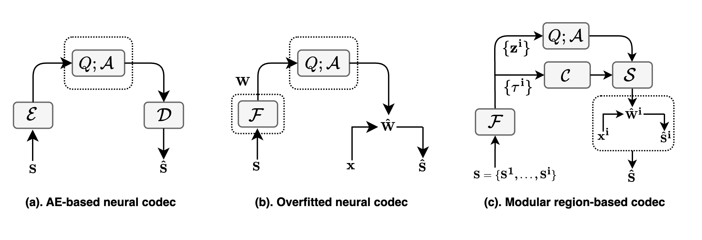
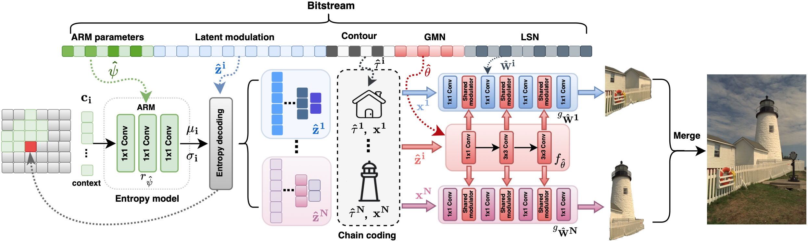
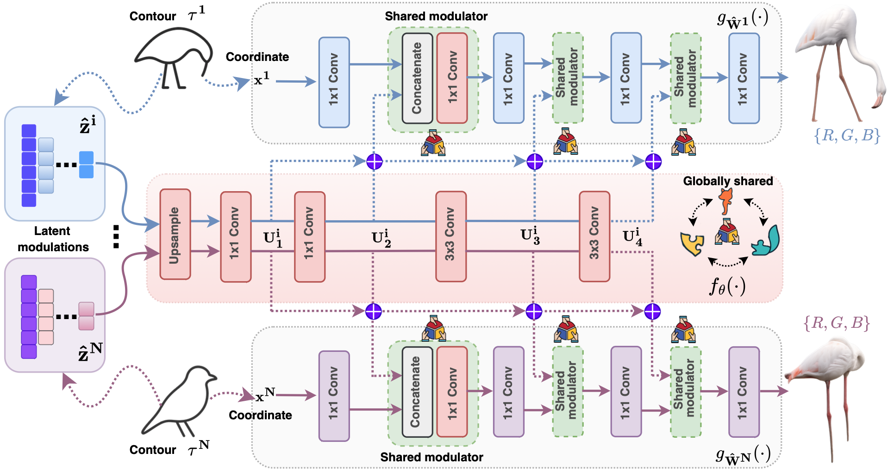
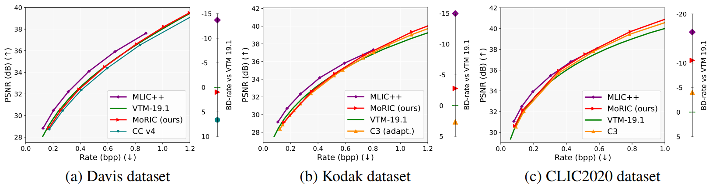
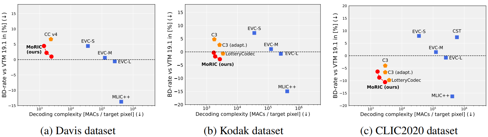

<p align="center">
  
</p>

<h1 align="center">
 MoRIC: A Modular Region-based Implicit Codec for Image Compression
</h1>

<p align="center">
  <a href="https://www.imperial.ac.uk/information-processing-and-communications-lab/people/">Gen Li </a><sup>*</sup>&nbsp;&nbsp;
  <a href="https://eedavidwu.github.io/">Haotian Wu</a><sup>*†</sup>&nbsp;&nbsp;
  <a href="https://www.imperial.ac.uk/information-processing-and-communications-lab/people/deniz/">Deniz Gündüz</a>  
  <br/>
  <strong>Imperial College London</strong>
   <br/>
  <sup>*</sup>Equal contribution &nbsp;&nbsp; <sup>†</sup>Project leader & Corresponding author
</p>

<p align="center">
  <a href="https://neurips.cc/virtual/2025/loc/san-diego/poster/118832" target="_blank">
    
  </a>
  <a href="https://eedavidwu.github.io/MoRIC/" target="_blank">
    
  </a>
</p>

## 📣 Latest Updates
- **[2026-9-02]** 📝 *Updated actual bistream*
- **[2025-11-03]** 📝 *Detailed intermediate results are now released on [results](https://github.com/eedavidwu/MoRIC/tree/main/results).*
- **[2025-10-31]** 🎉 *MoRIC has been accepted to **NeurIPS 2025**.

## 🔑 Key Takeaways

- **MoRIC** introduces a novel overfitted codec that assigns dedicated models to distinct regions in the image, each tai-
lored to its local distribution. This region-wise compression design improves adaptation to local content distributions and supports flexible, region-specific control for enhanced compression efficiency!

- **MoRIC** employs a Modular layered paradigm.

<p align="center">
  
</p>

- A **Progressive Concatenated Modulation** is introduced: Achieve global–local information sharing and layered progressive compression.



<p align="center">
  
</p>

## About this code
The MoRIC codebase is written in Python and provides fast configurations for the training. The core module structure is as follows:
```
MoRIC/
├── dataset/                          # Folder for dataset.
│   ├── CLIC2020.                
│   ├── Kodak/                   
├── enc/                          # Folder for encoding functions
│   ├── training/                
│   ├── utils/                 
├── models/                       # Main model.
│   ├── candidate_train.py 
│   └── model.py                  
├── results            # Experimental results for various models.
├── utils            # Code for sub-model and functions such as quantization/ARM/...
├── train.py

```
The code is heavily based on the Cool-Chic project, an outstanding open-source work :). For additional resources and attribution (such as engineering optimization), please refer to their project page:  <a href="https://github.com/Orange-OpenSource/Cool-Chic">Cool-Chic</a>  

## Results:
A better RD performance:
<p align="center">
  
</p>

Towards BD-rate vs. flexible complexity (a) Davis (b) Kodak and (c)CLIC2020:
<p align="center">
  
</p>

## Contact
- Haotian Wu: haotian.wu17@imperial.ac.uk
- Gen Li: gen.li22@imperial.ac.uk

Please open an issue or submit a pull request for issues, or contributions.

## 💼 License

<a href="https://opensource.org/licenses/MIT" target="_blank" rel="noopener noreferrer">
  
</a>

## Citation

If you find our resource/idea is helpful, please cite our paper:

```
  @article{MoRIC,
    title={MoRIC: A Modular Region-based Implicit Codec for Image Compression},
    author={Gen Li, Haotian Wu, and Deniz Gündüz},
    journal={Conference on Neural Information Processing Systems},
    year={2025}
  }

```

